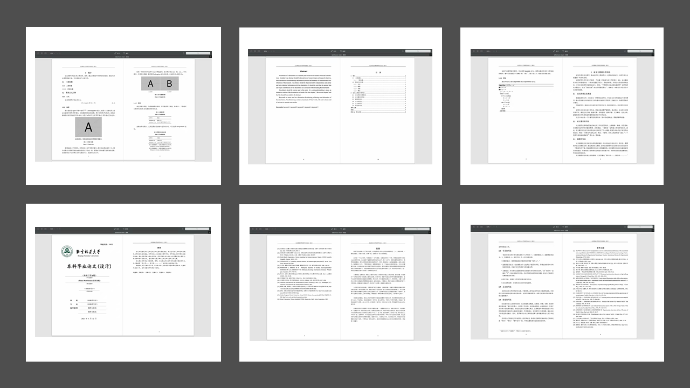

**写于2022.03：目前的开发者们已于2021年夏季顺利毕业，如果有兴趣的学弟学妹欢迎联系dyq21 AT mails.tsinghua.edu.cn，继续传承与开发~我们需要你的加入！**

# BJFUThesis
[](https://badges.toozhao.com/stats/01FQ0AKJADE9D565SJ7JV1H6KE "Get your own page views count badge on badges.toozhao.com") [](https://github.com/DeeDive/BJFUThesis)

## 欢迎使用BJFU-Thesis论文模板

此仓库旨在提供一个简单易用的北京林业大学学位论文 LaTeX 文档类（非官方）模板，用户可以参考或者直接基于此示例文档撰写报告。

LaTeX Thesis Template for Beijing Forestry University



## 获取模板

### 下载模版

普通用户可以直接 `clone` 或者在 [Github](https://github.com/DeeDive/BJFUThesis) 页面下载仓库代码。

```bash
git clone https://github.com/DeeDive/BJFUThesis.git
```

### Overleaf

Overleaf 用户可以从下面的模版链接创建自己的项目。

[](https://www.overleaf.com/latex/templates/bjfuthesis-beijing-forestry-university-thesis-latex-template/hqfjrfjxswgn)

## 使用 Visual Studio Code书写

您可以在正确配置Tex开发环境后，在Visual Studio Code中安装Tex Workshop插件进行书写，可以获得更的使用体验。

模板 `/.vscode/latex.code-snippets`预置了部分常用的代码模板，可以在编辑器中输入下方任意内容生成代码，现有的代码模板如下：

- table-basic-bjfu : 生成一个基本表格
- table-auto-long-text-bjfu : 生成一个可自动布局长文本表格
- table-cross-page-auto-long-text-bjfu : 生成一个可自动布局的跨页长文本表格
- figure-bjfu : 生成一个基本图片
- figure-muilt-bjfu : 生成一个含子图图片
- equation-bjfu: 生成一个公式
- list-inline-bjfu : 生成一个行内有序列表
- list-bjfu : 生成一个有序列表
- unordered-list-bjfu : 生成一个bjfu无序列表
- algorithm-bjfu : 生成一个bjfu算法

## 反馈与贡献

本模版目前是由同学兴趣小组维护的开源项目，我们非常欢迎问题反馈和新的贡献者！

### 成为贡献者

这个仓库是面向用户的示例模版，如果你有很好的排版示例，可以提交到此仓库与大家分享。如果你想要为 BJFUThesis 文档类贡献代码，你可以从这些问题开始熟悉贡献代码的流程。除了提交 Pull Request 之外，还有以下方式可以进行贡献：

+ 帮助我们解答同学们的[问题](https://github.com/DeeDive/BJFUThesis/issues)，这些问题你也可能遇到过并且知道如何解决；
+ **与我们一起创建或维护项目的 Wiki 文档**，Wiki 任何人都可以直接编辑；
+ 向周围同学安利 BJFUThesis，让更多有需要的同学使用模板；
+ 通过各种聊天渠道联系我们，成为项目的长期维护者:)

## 致谢

* BJFUThesis-启蒙 马起园 及 王政 学长早期的[BjfuLatexTemplate](https://github.com/ufo5260987423/BjfuLatexTemplate) 工作， 对于本项目的开发给予了极大的激励。
* 感谢[@thuthesis](https://github.com/tuna/thuthesis) 以及[@SJTUThesis](https://github.com/sjtug/SJTUThesis) 对于本模版开发的极大启发与帮助。
* BJFUThesis-v1 [引入2021版本最新格式规范] 窦勇强 庞博[@Bloomberg2000](https://github.com/Bloomberg2000) 方子东[@quaeast](https://github.com/quaeast/BjfuLatexTemplate) 同学对本模板开发的极大贡献与支持。
* 感谢所有为模板贡献过代码的[同学们](#)，以及所有在测试和使用模板的你。

## Future Direction
+ 一些初次接触同学友好的wiki
+ 研究生论文模板
+ 更好的模板，你来定义

**目前的开发者们已经毕业，如果有兴趣的同学欢迎联系dyq21 AT mails.tsinghua.edu.cn，继续传承与开发~**
